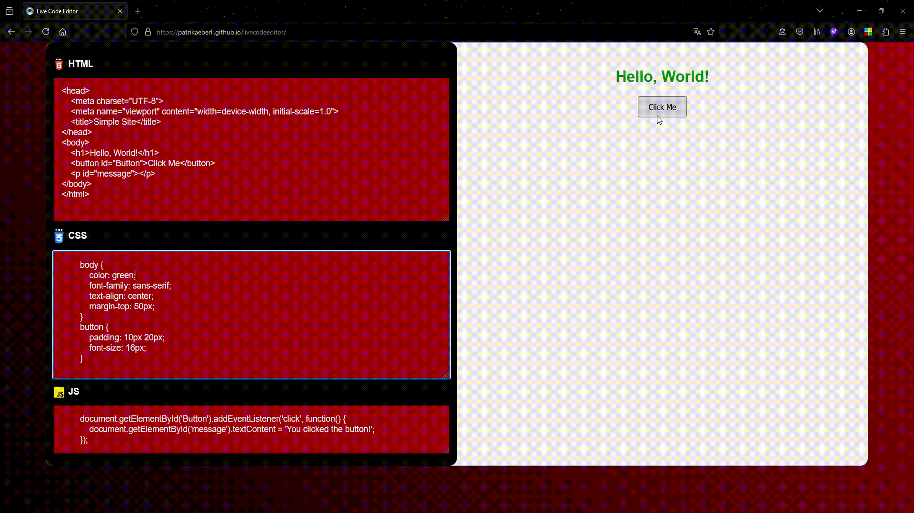

# **Live Code Editor**

A **Live Code Editor** built with HTML, CSS, and JavaScript that allows users to write and preview HTML, CSS, and JavaScript code in real-time. Users can upload their code snippets, and the output will be rendered live as they type.



[**Live Demo**](https://patrikaeberli.github.io/livecodeeditor/)

## **Features**

- **Live Preview**: Instant updates and live rendering of HTML, CSS, and JavaScript code.
- **Local Storage**: Automatically saves the written code to local storage so that users can pick up where they left off.
- **User-Friendly Interface**: A clean and responsive design that enables smooth code editing.
- **Responsive Layout**: Adjusts for different screen sizes for a better user experience.

## **How It Works**

- The page contains three editable text areas for HTML, CSS, and JavaScript code.
- As the user types, the code is automatically saved to `localStorage` and rendered live in an iframe on the right.
- The rendered code appears in real-time, showing the combination of the HTML structure, CSS styles, and JavaScript functionality.

## **Code Structure**

### **HTML**

The HTML structure includes a container for code editors (HTML, CSS, JS) and an iframe to display the live results.

### **CSS**

Custom styling includes a modern design with a color scheme of black, red, and white for a slick coding environment. Scrollbars, borders, and the editor layout are tailored for usability and aesthetics.

### **JavaScript**

JavaScript handles:
- Storing the code in `localStorage`
- Rendering the live code in the iframe by updating the inner HTML and applying styles dynamically.

```javascript
function run() {
    // Store the code in local storage
    localStorage.setItem('html_code', html_code.value);
    localStorage.setItem('css_code', css_code.value);
    localStorage.setItem('js_code', js_code.value);

    // Render the live preview in the iframe
    result.contentDocument.body.innerHTML = `<style>${localStorage.css_code}</style>` + localStorage.html_code;
    result.contentWindow.eval(localStorage.js_code);
}
